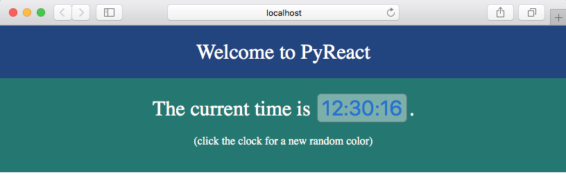

# Welcome to PyReact

[React](https://reactjs.org/) is a browser-based, client library that "makes it painless to create interactive UIs".  

Using it normally means you're coding in Javascript, but you want to instead code in our favorite language, Python, amirite?  Fortunately for you, [Transcrypt](https://www.transcrypt.org/) places Python (transpiled Python) right smack in the browser. But then the other shoe drops:

* Extending JS classes (`React.Component`) in Python isn't an obvious thing to do.
* Using `JSX` in Python can be maddening because it means transpiling a transpiled source.
* Using Python with `Transcrypt` works pretty well, but it has some gotchas. 

This is where `PyReact` and this demo come in.  **`PyReact = React + Transcrypt`**

## The Finished Product

This demo project makes the following page.  The clock upates every 200 ms and is clickable (but not in this png image :).



This demo project shows how to:

* extend the JS `React.Component` class
* use `.state` from Python
* create components with `createElement()` as well as with `JSX`
* set event handlers and callback functions
* send props to child components
* use various JS things like `Date()` and a timer
* use various Python things like list comprehensions and the `random` module


## Installation

Since this is a demo, the goal is few dependencies and setup:

* Download/clone the project.
* `pip3 install transcrypt livereload`
* Run `python3 dev_server.py` 

PyReact also works well within a full React project (npm, webpack, etc.), but that's beyond the scope of this document.


## Structure

The project structure is as follows:

```
index.html                      # bootstraps React in the <script> elements
dev_server.py                   # automatically runs transcrypt when needed (optional)
scripts/
    index.py                    # Main component of the app
    clock.py                    # Clock components
    pyreact.py                  # PyReact superclasses (extend from these)
scripts/__javascript__/         # Transcrypt puts the transpiled scripts here
scripts-lib/
    pyreact-js-bundle.js        # Gateway to the jsx transformer (required)
script-ext/                     # React sources from reactjs.org (required)
styles/                         # Plain old css
```

When you create new transcrypt scripts, they should be placed in `scripts/`.  Be sure to reference them in `index.html`.

## Where to Start

Start by reading `scripts/index.py` and `scripts/clock.py`.  These are the primary files of the project.


## Status and Future

`PyReact` isn't that big - it's just a small superclass for your Python objects, a JSX transformer, and most importantly, an example of how it's done.  `Transcrypt` comes with many examples, but the goal of `PyReact` is to show one way to set up a full project. It works well.

Future? Who knows. Right now I'm just putting this out there in hopes that it will be useful to others. 

Best wishes, 

Conan Albrecht [https://github.com/doconix/](https://github.com/doconix/)

November, 2017